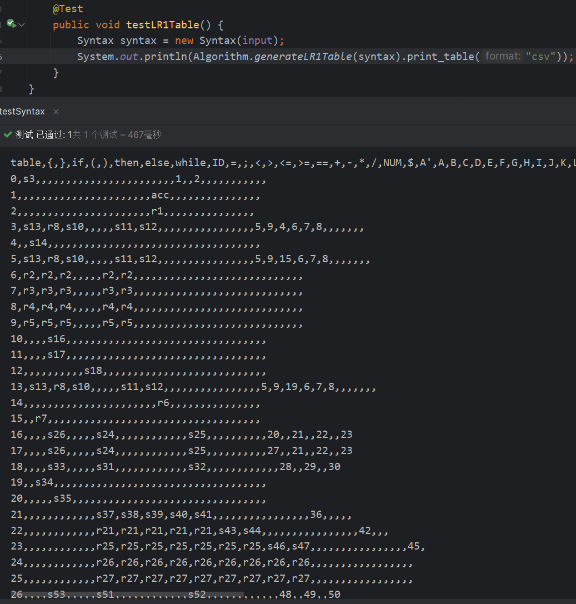

# compile table generator

该项目可以通过加载LL1或LR1文法自动构建出其使用过程中的分析表。

文法样例：

```
A -> C 
B -> E
B -> F
B -> G
B -> C
C -> { D }
D -> B D
D -> epsilon
E -> if ( H ) then B else B
F -> while ( H ) B
G -> ID = J ;
H -> J I J
I -> <
I -> >
I -> <=
I -> >=
I -> ==
J -> L K
K -> + L K
K -> - L K
K -> epsilon
L -> N M
M -> * N M
M -> / N M
M -> epsilon
N -> ID
N -> NUM
N -> ( J )
```
LL1构造：


LR1构造：



